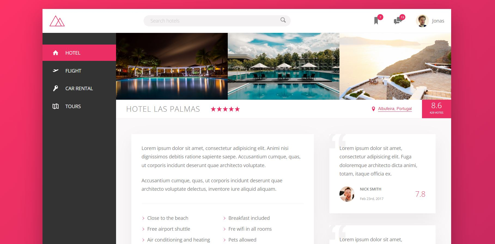
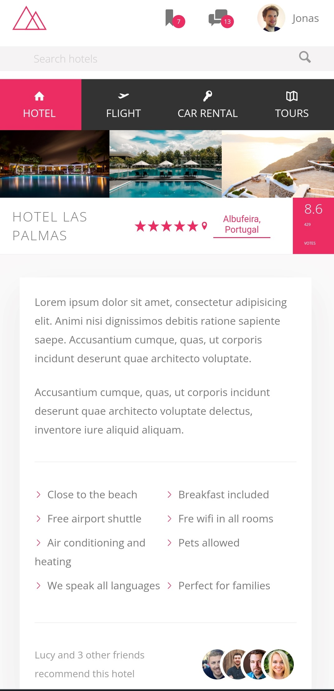

# Trillo Project

Fictional all-in-one booking app (for hotels, flights, car rentals, and tours)

This project was built with the author in an online course "Advanced CSS and Sass: Flexbox, Grid, Animations and More!" from Udemy.

## Table of contents

- [Overview](#overview)
  - [Screenshot](#screenshot)
  - [Links](#links)
- [My process](#my-process)
  - [Built with](#built-with)
  - [What I learned](#what-i-learned)
  - [Useful resources](#useful-resources)

## Overview

Users should be able to:

- View the optimal layout depending on their device's screen size
- See hover, active, and focus states for interactive elements on the page
- See really responsive design thanks to using Flexbox

### Screenshot

Desktop screen:

Mobile screen:

### Links

- Live Site URL: [Live site from GIT](https://irina-dehtiarenko.github.io/Project-Trillo-with-scss-flex/)

## My process

### Built with

- Semantic HTML5 markup
- SASS(SCSS)
- Flexbox
- Desktop first principle
- NPM commands

### What I learned

I learned about:

- Building the overall layout of the page using flexbox

### Useful resources

- [Advanced CSS and Sass: Flexbox, Grid, Animations and More!](https://www.udemy.com/course/advanced-css-and-sass/) - This is the course during which I built this project, I also learned a lot of useful things. The author explains everything very thoroughly, very deeply explaining complicated things.
